# 前端 Entry Task 2（React）

[需求说明](https://docs.google.com/document/d/1CGTXfkHCkfTQkMGVi0yUo6yh1GGpasfjrgzHUJcRDxc/edit#heading=h.gjdgxs)<br/>
[前端设计稿](https://drive.google.com/open?id=1Byvo9t4bVs9DAVLtjzaMeDm2QmRkEDuS)<br/>
[后端项目](https://git.garena.com/jinyang.li/pangolier)<br/>
[后端 API 设计文档](https://docs.google.com/document/d/1G7M8M5JQzfZjGeHD7mrzDk2-M_NaR8RsBndFxs8DIEw/edit?usp=sharing)<br/>

## 项目架构选型

* 框架——react + react-router + redux + redux-saga + typescript
* 模块打包工具——webpack4
* 语法检测——standard+eslint+prettier
* 样式预处理——sass、css-module
* 开发使用——redux-logger、redux-devtools-extension
## 项目启动
启动本项目之前，先启动 [pangolier](https://git.garena.com/jinyang.li/pangolier) 项目：

```shell
git clone ssh://gitlab@git.garena.com:2222/jinyang.li/pangolier.git && cd pangolier

npm i

npm start
```

打开浏览器访问 `http://localhost:3000/test`
然后启动本项目
### 安装依赖包

`npm install`

### 启动

`npm start`

### 配置跨域

```json
"proxy": "http://localhost:8080/api/v1",
```
注意配置跨域，需要和后端请求的地址一致

依赖安装完成之后，更改 `baseURL` 改为如下值：

```js
// src/utils/api.ts
export const baseURL = Wanted
```

### 目录说明

```
src
|____actions                      存放actions，数据请求操作存放
|____api                          存放HTTP请求，请求头、请求方法
|____assets                       存放静态资源
| |____fonts                         存放字体文件
| |____icons                         存放图标文件
| |____imgs                          存放图片文件
|____components                   存放公用组件，方便模块化
| |____DatePicker                    选择日期的筛选器
| |____DetailBar                     详情选择查看条
| |____DetailComment                 详情评论
| |____DetailDescription             活动描述详情
| |____DetailInfo                    活动详情
| |____DetailParticipants            参与者头像条
| |____ErrToast                      评论出错toast
| |____EventCell                     列表的每个小格子
| |____Header                        导航头部
| |____MainEventList                 活动详情列表
| |____Result                        筛选结果
| |____Search                        选择页面
| |____UserEventList                 用户活动详情列表
| |____UserInfo                      用户信息
| |____UserTabs                      用户选择查看条
|____containers                   存放页面模块，以页面为单位
| |____Login                         登陆页面
| |____Main                          活动列表主页面
| |____Detail                        活动详情页面
| |____Me                            用户信息页面
| |____Error                         错误页面
|____lang                         存放国际化翻译的json
|____reducers                     存放reducers，存放相关数据
|____sagas                        存放异步请求的方法
|____scss                         存放公用样式
|____utils                        存放工具方法
|____index.tsx                    入口文件
|____index.scss                   入口文件样式
|____i18n.ts                      存放国际化的配置方法
```

### store 设计

按页面拆分成error、event、search、usr , 分别代表错误处理、活动、筛选、用户相关的状态。并应用了redux-saga中间件，处理异步请求。

```
|____reducers
| |____error.ts
| |____event.ts
| |____index.ts
| |____search.js
| |____user.js
```

### 公共样式

1. 根据设计稿定义了全局的 color 变量
2. 可复用组件的样式

#### color schema

>color.scss

```scss
$primary: #8560A9;
$primary-neutral: #67616D;
$primary-light: #D3C1E5;
$primary-dark: #453257;
$background: #FAF9FC;
$primary-medium: #AC8EC9;

$complement: #D5EF7F;
$complement-dark1: #AECB4F;
$complement-dark2: #788C36;
$complement-light: #E5F7A9;

$disabled-text-light: #BABABA;
$disabled-text-medium: #8C8C8C;
$disabled-text-dark: #666666;
$white: #FFFFFF;
$red: #FF5C5C;
$border-light: #E8E8E8;
```

#### font 字体

* SourceSansPro-Regular:400
* SourceSansPro-Semibold:600
* SourceSansPro-Bold:700

### 设计稿尺寸转换、CSS Module
样式使用了css-modules、SCSS。通过rem来实现响应式布局，根据根元素宽度决定其font-size大小。使该应用能在不同尺寸的手机屏幕上正常显示。
```js
const setRem = () => {
  const html = document.getElementsByTagName('html')[0]
  const width = html.getBoundingClientRect().width
  const rem = width / 22.8
  html.style.fontSize = rem + 'px'
}
```

### 阿里图表库

`//at.alicdn.com/t/font_1236043_fyxogxyfsav.css`

- 第一步：引入项目下面生成的 fontclass 代码：
  `<link rel="stylesheet" href="./iconfont.css">`
- 第二步：挑选相应图标并获取类名，应用于页面：
  `<span class="iconfont icon-xxx"></span>`

### 登录权限校验
#### 路由配置
```js
        <Switch>
          <Route path='/' exact component={Login} />
          <PrivateRoute path='/main/' component={Main} />
          <PrivateRoute path='/event/:id' component={Detail} />
          <PrivateRoute path='/me/' component={Me} />
          <Route component={NotFound} />
        </Switch>
```
#### 路由组件限制
使用`PrivateRoute`封装了登录检验逻辑，没有登录（store中无对应token信息）的用户无法访问`PrivateRoute`，会重定向至登录页
```js
const PrivateRoute = ({ component: Component, user, ...rest }) => (
  <Route
    {...rest}
    render={props =>
      user.token ? (
        <Component {...props} />
      ) : (
        <Redirect to={{ pathname: '/', state: { from: props.location } }} />
      )
    }
  />
)
```

### 无限虚拟滚动
基于IntersectionObserver监听列表底部元素实现无限滚动：
- 每次访问活动列表先请求25条数据并展示
- 当滚动至列表底部即将进入可视区域时，如hasMore字段为true，则继续请求25条数据并插入到列表之后

不足之处是从其他页面回到列表页时，列表总是在初始位置。没有实现虚拟列表，当数据项过大时，dom元素过多会造成卡顿
TODO: 虚拟列表

### i18n 多国语言
原理其实很简单： 字符串替换。
拉取远程的国际化json文件到本地，再根据语言做一个映射就可以了。
#### 方法一
登录页可选择切换英语、中文、日本语。实现的方案是在lang中配置对应的语言文件
根据选择的语言require对应的配置文件，并通过键值对引入对应的值展示。默认语言为英语，点选切换后将语言的缩写存储在localstorge中，再次访问时显示上次选择的语言。
#### 方法二
使用i18n-react

初始化
```js
i18next.init({
  lng: 'en',
});
```
切换系统语言
```js
import { changeLanguage } from '@src/i18n';

  // ...

  // 设置为印尼语
  changeLanguage('id');
```
为了保存语言设置, 可以把 language 保存在 localStorage 中, 使用的时候直接从 storage 里取。
### 项目截图
#### 登录页面
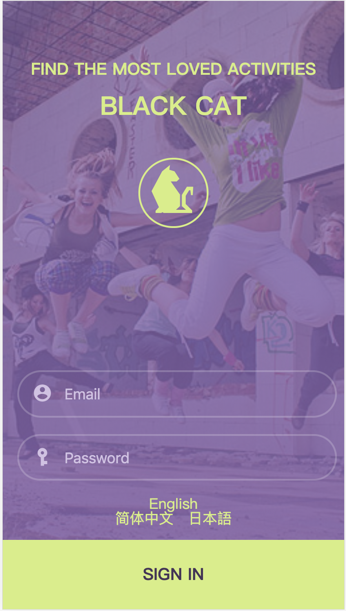
#### 活动列表页面
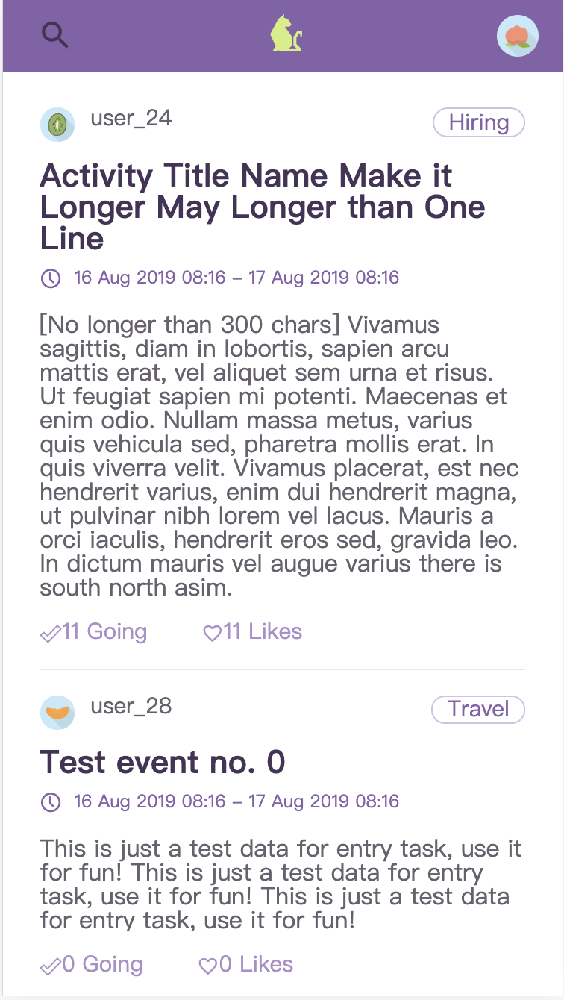
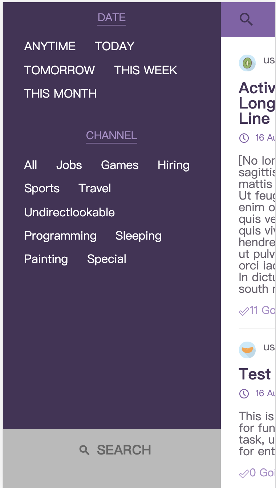
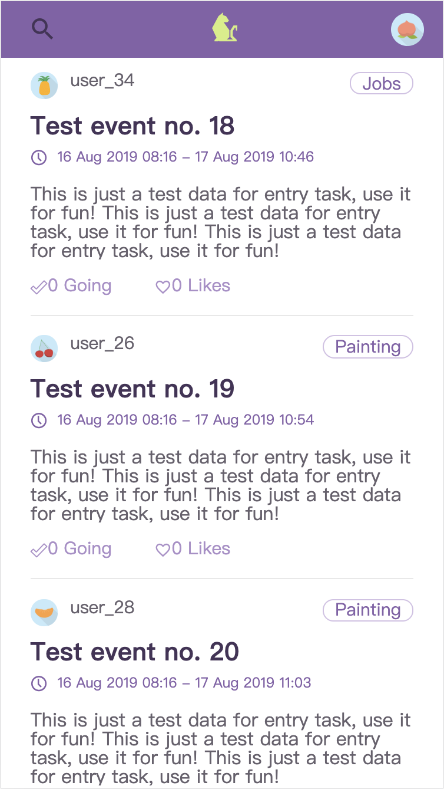
#### 筛选结果页面
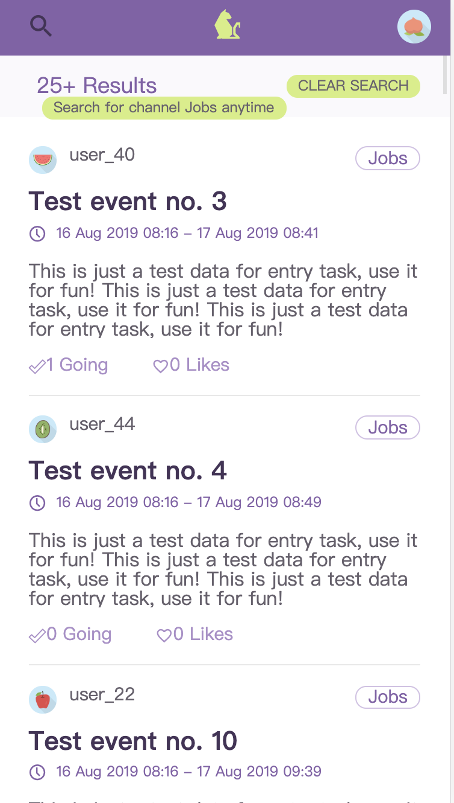
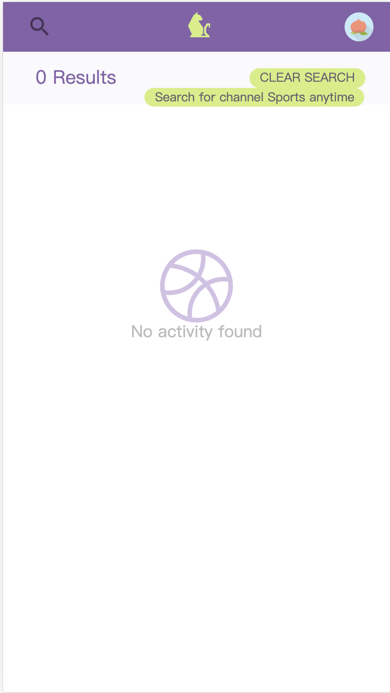
#### 活动详情页面
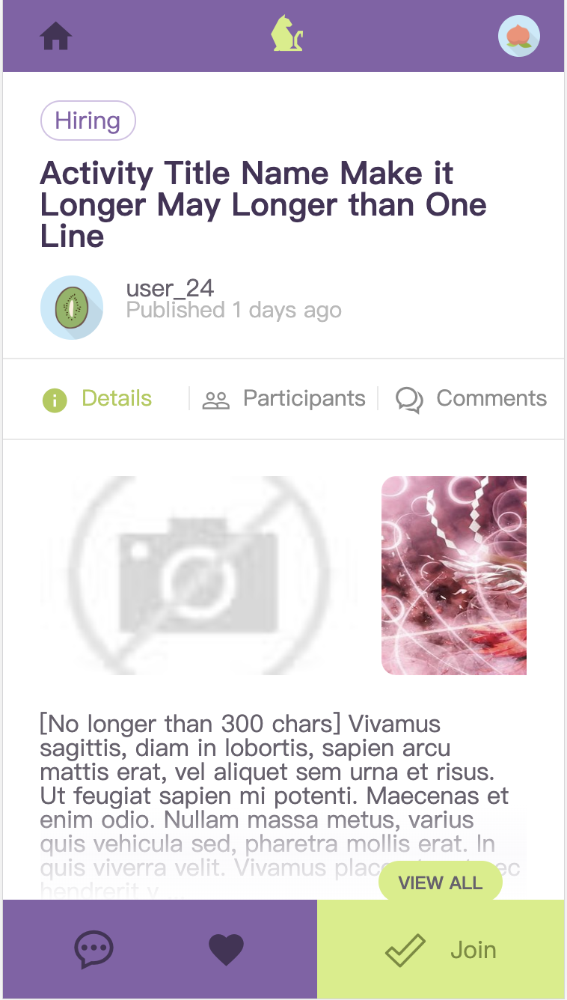
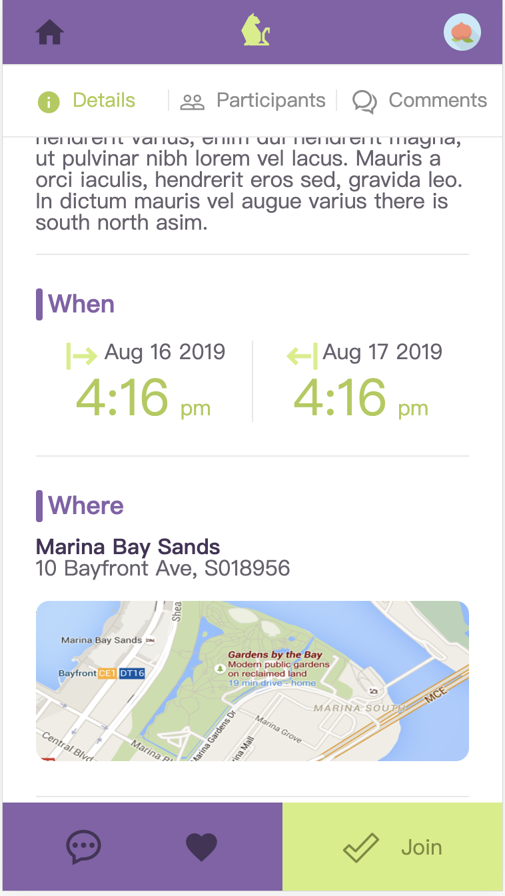
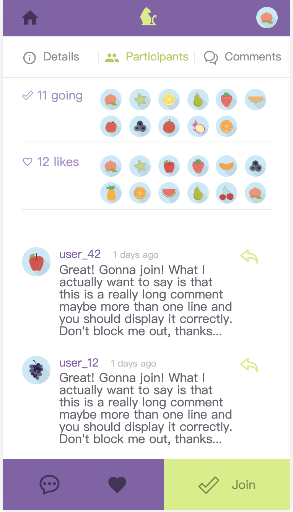
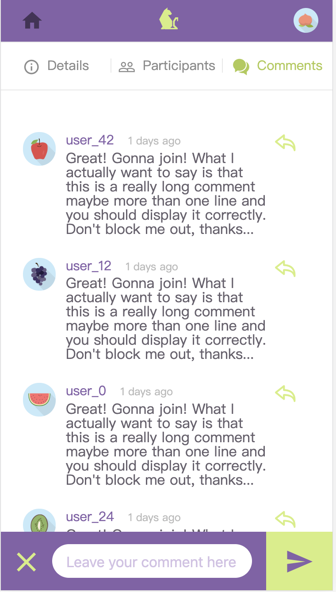
#### 用户详情页面
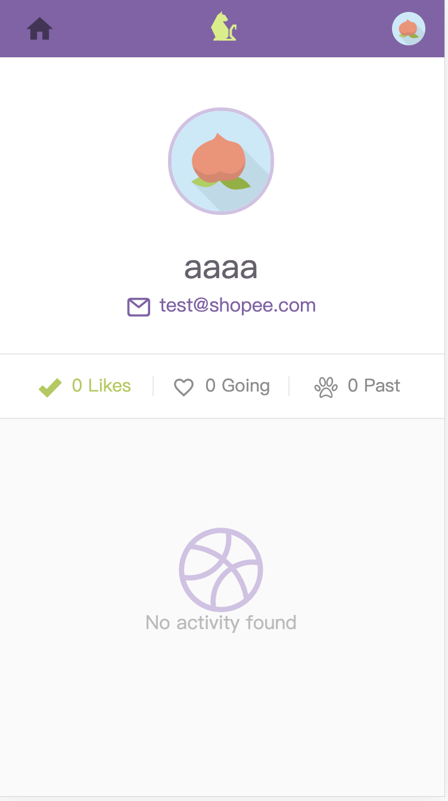
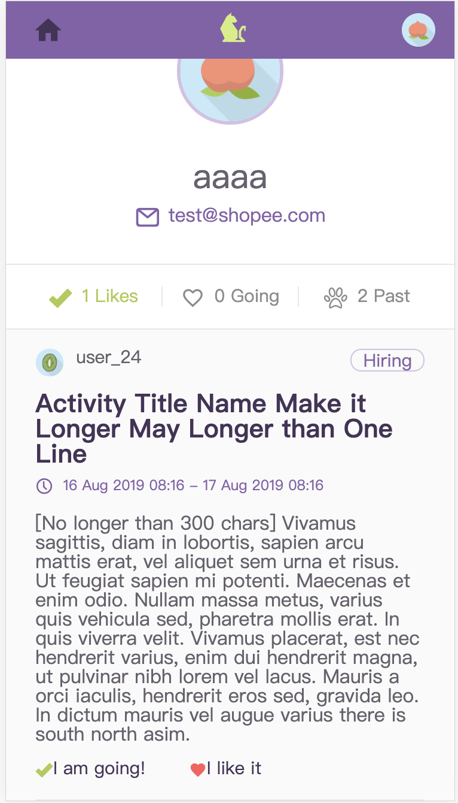